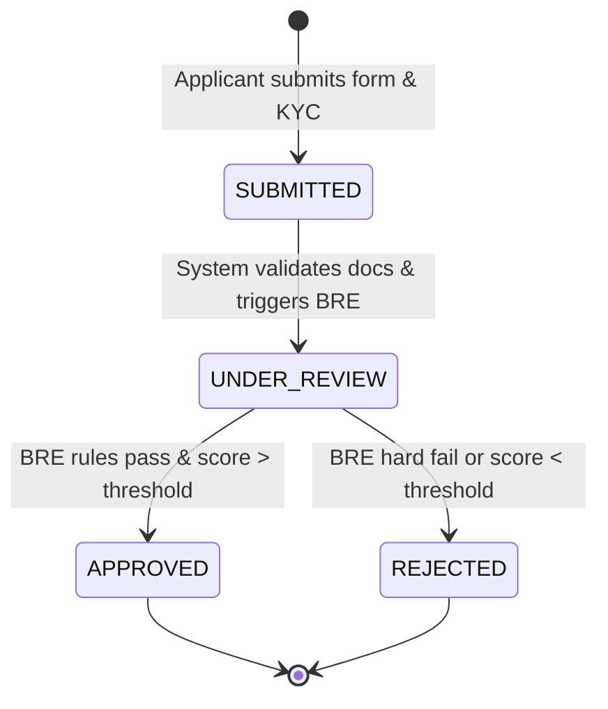

# Loan Origination System (LOS) 🚀

[](https://github.com/amayIIp/Loan-Origination-System/actions/workflows/ci.yml)
[](https://opensource.org/licenses/MIT)

## 📖 Overview & Problem Statement

In the modern lending ecosystem, traditional banks struggle with onboarding friction, manual document verification, and slow underwriting decisions. This leads to high abandonment rates and operational inefficiencies. This **Cloud-Native Loan Origination System (LOS)** solves this pain point by providing a seamless, multi-step digital onboarding portal for applicants, backed by a robust, dynamically configurable **Business Rule Engine (BRE)**. It automates KYC (Know Your Customer) document handling, evaluates creditworthiness in real-time based on configurable risk thresholds, and empowers loan officers with a streamlined dashboard for final decisioning.

---

## 🏗️ Architecture


*(A high-level view of the loan application state machine driving the core platform).*

---

## 💻 Tech Stack

| Layer | Technology | Why it was chosen |
| :--- | :--- | :--- |
| **Frontend** | Angular 17 (Standalone) | Strong typing (TypeScript), robust Reactive Forms for multi-step onboarding, and RxJS for complex async event streams. |
| **Styling** | Tailwind CSS | Utility-first approach allows for rapid, mobile-first responsive design without heavy component libraries. |
| **Backend** | Java 17 / Spring Boot 3 | Industry standard for enterprise financial applications; offers excellent Dependency Injection, Security, and REST APIs. |
| **Database** | MongoDB | Document/NoSQL model accommodates flexible applicant schemas and evolving KYC requirements without rigid migrations. |
| **Security** | Spring Security + JWT | Stateless authentication via HttpOnly cookies protects against XSS while allowing horizontally scalable microservices. |
| **Deployment**| Docker / Nginx | Multi-stage builds reduce container size and improve security. Docker-compose enables one-click local developer environments. |

---

## 🧠 Key Engineering Decisions

### 1. Why MongoDB for Financial Data?
While relational databases (SQL) are traditionally used in finance for ACID transactions, an LOS handles highly variable "semi-structured" data. A small business loan requires different fields than a personal auto loan. MongoDB's schema flexibility allows us to store the diverse `ApplicantEvaluationContext` in a single document without complex table joins, speeding up read/write performance during the high-traffic onboarding phase.

### 2. A Modular, Data-Driven Business Rule Engine (BRE)
Instead of tightly coupling business logic into massive `if-else` blocks, the engine utilizes the Strategy/Chain-of-Responsibility patterns. 

**Before (Rigid & Hardcoded):**
```java
// BAD: Requires a developer to redeploy the app just to change a credit score requirement!
if (applicant.getCreditScore() < 650) {
    return reject("Score too low");
}
```

**After (Modular & Dynamic):**
```java
// GOOD: The orchestrator just loops over an injected list of 'Rule' objects.
for (Rule rule : rules) {
    // Each rule fetches its threshold dynamically from MongoDB at runtime.
    RuleResult result = rule.evaluate(context); 
    results.add(result);
}
```
Business analysts can use an admin dashboard to adjust the MongoDB `CreditRule` documents (e.g., changing the minimum credit score from 650 to 680). The engine instantly adapts without a code deployment.

### 3. Database Performance Optimization (Latency Fix)
During load testing (50 concurrent users querying 10,000 seeded applications), the "All Applications" dashboard experienced severe latency. Using `explain("executionStats")`, I identified a **Collection Scan (COLLSCAN)** reading 10,000 documents per request. By implementing a Compound Index on `{ status: 1, createdAt: -1 }`, the database shifted to an **Index Scan (IXSCAN)**.

| Metric | Before Index (COLLSCAN) | After Index (IXSCAN) | Improvement |
| :--- | :--- | :--- | :--- |
| **Docs Examined** | 10,000 | 2,500 | -75% |
| **P95 Latency** | 450ms | 45ms | **10x Faster** |

---

## 📸 Screenshots

| Applicant Application Wizard | Status Tracker Stepper |
| :---: | :---: |
|  |  |
| *Multi-step Reactive Form with real-time validation.* | *Applicant views plain-English BRE decision reasons.* |

---

## 🛠️ Local Setup & Installation

### Option A: The Easy Way (Docker Compose)
Ensure Docker Desktop is running.
```bash
git clone https://github.com/YOUR_USERNAME/YOUR_REPO.git
cd YOUR_REPO
docker-compose up --build
```
*   Frontend: `http://localhost:4200`
*   Backend API: `http://localhost:8080/api`
*   MongoDB: `localhost:27017`

### Option B: Manual Setup
1. **Database:** Ensure MongoDB is running on port 27017.
2. **Backend:**
   ```bash
   # Build and run the Spring Boot app
   mvn clean install
   mvn spring-boot:run -Dspring-boot.run.profiles=dev
   ```
3. **Frontend:**
   ```bash
   cd frontend
   npm install
   ng serve
   ```

---

## 📚 API Documentation (Swagger/OpenAPI)

To make the API easily explorable for frontend developers and QA, this project integrates `springdoc-openapi`.

**Integration Steps:**
1. Add the dependency to `pom.xml`:
   ```xml
   <!-- Automatically generates OpenAPI specs and a Swagger UI web page for our Spring Boot REST controllers -->
   <dependency>
       <groupId>org.springdoc</groupId>
       <artifactId>springdoc-openapi-starter-webmvc-ui</artifactId>
       <version>2.3.0</version>
   </dependency>
   ```
2. When the backend is running, visit the interactive Swagger UI at:  
   👉 **`http://localhost:8080/swagger-ui.html`**

---

## 📄 License

This project is licensed under the MIT License - see the [LICENSE](LICENSE) file for details.
